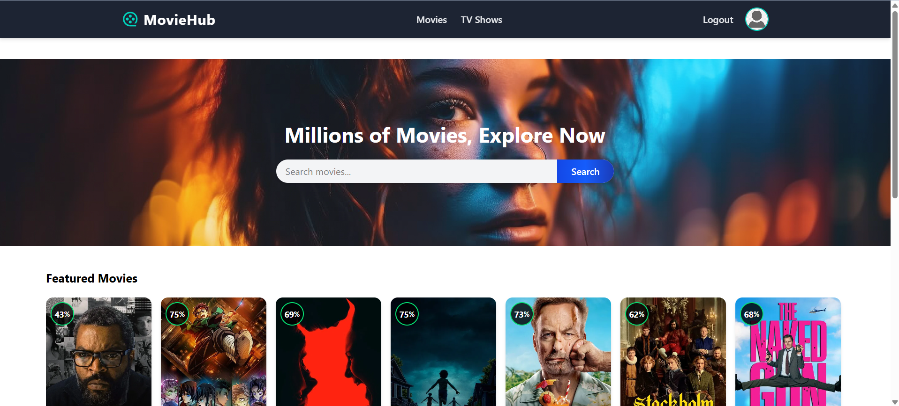

# 🎬 MovieReview – MERN Stack Movie Review Platform

MovieReview is a modern, full-stack web application built with the **MERN stack**. It lets users discover trending and popular movies, view rich details (cast, trailer, synopsis), post reviews with ratings, and manage their personal watchlist and profile—all with a beautiful, responsive UI.

---

## 🚀 Features

- **Browse Movies:** Explore trending and popular movies via the TMDB API
- **Movie Details:** View posters, backdrops, genres, director, cast, trailers, and overviews
- **User Authentication:** Secure JWT-based login/signup with hashed passwords
- **Post Reviews:** Leave star ratings and text reviews on any movie
- **Review History:** See your review history on your profile page
- **Watchlist Management:** Add or remove movies from your personal watchlist
- **Responsive Design:** Fully optimized for mobile and desktop
- **Performance Caching:** Redis caching for movies and reviews for lightning-fast performance

---

## 🛠️ Tech Stack

- **Frontend:** React, React Router, TailwindCSS, React Hot Toast
- **Backend:** Node.js, Express.js, MongoDB (Mongoose), Redis
- **API:** [TMDB API](https://developer.themoviedb.org/) for movie data
- **Authentication:** JWT (JSON Web Tokens), bcrypt for password hashing
- **Deployment:** Render (Frontend + Backend)

---

## 📦 Getting Started

### 1. Clone the Repository

```bash
git clone https://github.com/your-username/movie-review-platform.git
cd movie-review-platform
```

### 2. Install Dependencies

**Backend**
```bash
cd server
npm install
```

**Frontend**
```bash
cd ../client
npm install
```

### 3. Configure Environment Variables

Create a `.env` file in the `server` directory with the following:

```env
PORT=5000
MONGO_URI=your_mongodb_connection_string
JWT_SECRET=your_jwt_secret
TMDB_API_KEY=your_tmdb_api_key
REDIS_PORT=your_redis_port
REDIS_HOST=your_redis_host
REDIS_PASSWORD=your_redis_password
```

Create a `.env` file in the `client` directory with:

```env
VITE_SERVER_URL=http://localhost:5001/api
```

### 4. Run the Application

**Start the Backend**
```bash
cd server
npm run dev
```

**Start the Frontend**
```bash
cd ../client
npm run dev
```

---

## 🌟 Screenshots

### 🔐 Home Page


---


## 🙏 Acknowledgements

- [TMDB API](https://developer.themoviedb.org/) for movie data
- [Render](https://render.com/)